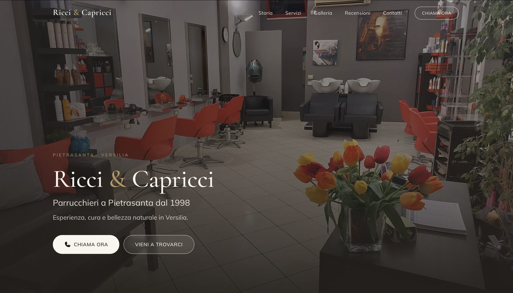
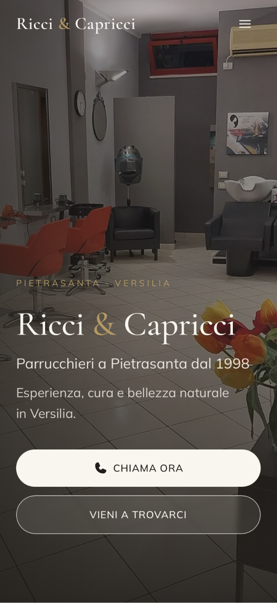

# Ricci & Capricci — Landing Page

Landing page premium per **Ricci & Capricci**, salone di parrucchieri storico a
Pietrasanta (Versilia, Italia), attivo dal 1998.

Sito vetrina single-page pensato per trasmettere l'identità del salone —
esperienza, cura e atmosfera — e convertire le visite in contatti telefonici e
visite in negozio.

> Progetto realizzato come lavoro di web design completo: dal design system
> alla resa responsive, fino alla cura dei dettagli tipografici e di motion.

---

## Il cliente e il contesto

Ricci & Capricci è un salone di quartiere con oltre 25 anni di attività e una
clientela fedele di ogni età, in una zona — la Versilia — dove l'estetica e la
cura della persona hanno un peso culturale forte. L'obiettivo non era un sito
"tecnologico", ma un sito **credibile, caldo e immediato**, capace di:

- comunicare affidabilità e heritage (dal 1998);
- valorizzare il salone reale, il lavoro e l'atmosfera;
- rendere ovvia e facile l'azione principale: **chiamare** o **venire in salone**.

## Obiettivi del redesign

- **Valore percepito alto** attraverso eleganza, fluidità e qualità visiva,
  non attraverso effetti vistosi.
- **Mobile-first**: la maggior parte del traffico di un salone locale arriva da
  smartphone (ricerche "parrucchiere vicino a me", Instagram).
- **Leggibilità per tutte le età**: corpo testo generoso, contrasto curato.
- **Conversione**: CTA "Chiama ora" sempre raggiungibile (navbar, hero,
  contatti) e mappa integrata.
- **Autenticità**: solo foto reali del salone e dei lavori, niente stock.

---

## Stack tecnologico

| Tecnologia | Uso |
| --- | --- |
| [Next.js 14](https://nextjs.org/) (App Router, RSC) | Framework, routing, ottimizzazione immagini |
| [TypeScript](https://www.typescriptlang.org/) | Tipizzazione end-to-end |
| [Tailwind CSS](https://tailwindcss.com/) | Design system utility-first, token bloccati |
| [Framer Motion](https://www.framer.com/motion/) | Animazioni d'ingresso e micro-interazioni |
| [Phosphor Icons](https://phosphoricons.com/) | Set icone coerente |
| `next/font` | Self-hosting font (Cormorant Garamond + Mulish) |

---

## Scelte UX/UI

**Direzione estetica: _luxury naturale_** — calda, accogliente, con la
fotografia protagonista (mood beauty / boutique).

- **Palette** (bloccata in `tailwind.config.ts`): bianco caldo (`panna`,
  `avorio`), beige/sabbia (`sabbia`, `terra`), nero soft (`inchiostro`, `fumo`)
  e **oro leggero (`oro`) come unico accento**, usato con parsimonia.
- **Tipografia**: serif elegante _Cormorant Garamond_ per i titoli (heritage),
  sans umanista _Mulish_ per il corpo (leggibilità). `text-wrap: balance` sui
  titoli e `pretty` sul corpo per evitare righe orfane.
- **Sistema forme**: elementi interattivi a pillola, superfici e immagini con
  raggio morbido coerente.
- **Hero**: foto reale dell'interno del salone con **effetto Ken Burns**
  lentissimo (zoom impercettibile, ~32s) che dà vita alla pagina senza
  distrarre. Layer media e layer testo completamente separati; scrim caldo per
  garantire il contrasto del testo.
- **Motion discreto**: fade-in + slide-up soft all'ingresso nel viewport, zoom
  delicato sulle immagini in hover, navbar che passa da trasparente a solida
  allo scroll.
- **Accessibilità**: tutte le animazioni rispettano `prefers-reduced-motion`;
  focus state visibili; contrasto del testo curato nelle zone con foto.

---

## Struttura delle sezioni

Single-page composta in [`app/page.tsx`](app/page.tsx):

1. **Hero** — foto del salone (Ken Burns) + claim e CTA principali.
2. **About / La nostra storia** — split asimmetrico testo + immagine mood, con
   numeri chiave (anni di attività, territorio).
3. **Servizi** — griglia dei servizi (taglio, colore, piega, trattamenti) con
   micro-interazioni in hover.
4. **Galleria** — i lavori reali su capelli in **scroll orizzontale** con snap.
5. **Recensioni** — valutazione Google e testimonianze reali dei clienti.
6. **Contatti** — indirizzo, telefono, CTA e mappa Google integrata.

```
.
├── app/
│   ├── globals.css       # base, token, classi (.btn-*, .eyebrow, .container-site, Ken Burns)
│   ├── layout.tsx        # layout: font + Navbar + Footer + metadata SEO
│   └── page.tsx          # homepage: composizione delle sezioni
├── components/
│   ├── Navbar.tsx        # nav fissa, trasparente sull'hero, solida allo scroll
│   ├── Footer.tsx        # footer con navigazione e contatti
│   ├── HeroMedia.tsx     # layer media della hero (foto + Ken Burns)
│   ├── ZoomImage.tsx     # immagine con zoom soft in hover (next/image)
│   └── motion.tsx        # primitive Framer Motion (FadeIn, Stagger, StaggerItem)
├── sections/
│   ├── Hero.tsx
│   ├── About.tsx
│   ├── Services.tsx
│   ├── Gallery.tsx
│   ├── Reviews.tsx
│   └── Contact.tsx
├── lib/
│   ├── site.ts           # dati del salone centralizzati (telefono, indirizzo, mappa, social)
│   └── images.ts         # manifest delle immagini reali
└── public/images/        # foto reali del salone e dei lavori
```

I dati di contatto e le immagini sono **centralizzati** in `lib/site.ts` e
`lib/images.ts`: un unico punto da aggiornare per telefono, indirizzo, mappa e
nuove foto.

---

## Ottimizzazioni responsive

- **Approccio mobile-first**: ogni layout multi-colonna dichiara esplicitamente
  il collasso a colonna singola sotto `768px`.
- **Viewport stabile**: hero in `min-h-[100dvh]` (niente salti con la barra
  indirizzi di iOS Safari), nessun layout shift.
- **Immagini**: `next/image` con `sizes` corretti, `priority` sull'hero (LCP),
  ottimizzazione e formati moderni automatici.
- **Griglie**: CSS Grid con breakpoint standard; la sezione Servizi adatta
  l'ultima card per evitare orfani nel layout a 2 colonne.
- **Tipografia** e spaziature scalate per `sm` / `lg`.
- **Galleria** a scroll orizzontale con `scroll-snap`, ottimale al tocco.

---

## Screenshot

| Desktop | Mobile |
| --- | --- |
|  |  |

> Gli screenshot vanno aggiunti in `docs/screenshots/` (vedi le istruzioni in
> quella cartella).

---

## Installazione locale

Requisiti: **Node.js 18+** e npm.

```bash
git clone <url-del-repository>
cd website_RICCI&CAPRICCI
npm install
npm run dev
```

Il sito è disponibile su [http://localhost:3000](http://localhost:3000).

## Build di produzione

```bash
npm run build    # build ottimizzata
npm run start    # serve la build in locale
```

---

## Note

Tutti i contenuti (testi, recensioni, dati di contatto) e le fotografie sono
reali e relativi al salone Ricci & Capricci. Repository a scopo dimostrativo /
portfolio.
